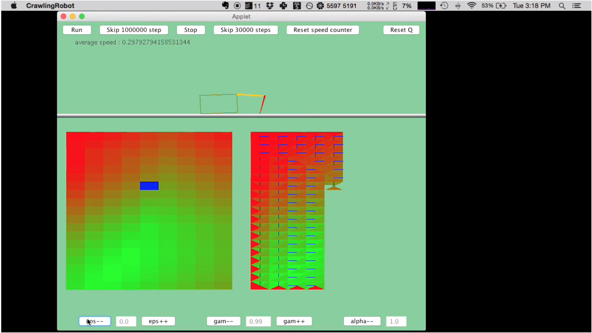

# Crawler CS188

Custom homemade replica of Berkeley's CS188 class implemented in C++, wxWidgets and SDL2 by Patrick Marangone (@[pmarangone](https://github.com/pmarangone)) and Sergei Kononov (@[hemulens](https://github.com/hemulens)). Please find our original project repository [here](https://github.com/pmarangone/crawler/tree/master).

## Target Interface Example

## Tentative TODOs

### Choose Approach

- [x] Find an approach to build a CS188's crawler GUI and graphics
- [x] Choose best suitable libraries
  - [x] a) Use WxWidgets for GUI
  - [x] b) [Integrate](http://code.technoplaza.net/wx-sdl/) SDL2 (graphics) into WxWidgets GUI (canceled: Mac's Cocoa misbehaves, conflict with GTK+)

### Build GUI

- [x] Create top and bottom panels
- [x] Add two buttons: ["run", "stop"] + see other buttons needed
- [x] Make the bottom control panel neat:
  - [x] Step delay, discount, epsilon, learning rate
  - [x] Create output fields / text fields with background
  - [x] Round edges of spin controls: (canceled)
    - [x] SetThemeEnabled
    - [x] SetExtraStyle, SetWindowStyleFlag, SetWindowStyle
    - [x] SetLayoutDirection, SetWindowVariant
  - [x] Wire up controls:
    - [x] Create and connect IDs and functions
    - [x] Set increment step sizes
    - [x] Set default values (through CrawlingRobot)
    - [x] Set min/max ranges
    - [x] Read values from spin controls
    - [x] Pass values from spin controls to CrawlingRobot class instance living in the MainFrame (_robot)
- [x] Refactor panels:
  - [x] Move all three panels to panels.h (canceled)
  - [x] Create two polymorph classes from wxPanel (TopPanel, BottomPanel) (canceled)
  - [x] Set controls ownership to the parent class
  - [x] Destroy spin controls in the parent class destructor (bottom panel) (canceled)
  - [x] Destroy btn controls in the parent class destructor (top panel) (canceled)
  - [x] Destroy panels in the parent class destructor
- [x] Ownership of control variables:
  - [x] Move '_learningRate', '_discount' and '_epsilon' to CrawlingRobot
  - [x] Transfer data to CrawlingRobot class
  - [x] Make control handles private class members
- [x] Abstract away layout initialization process
  - [x] Create menu initialization function
  - [x] Create panel initialization function
  - [x] Create app layout initialization function
- [ ] Repair the bug: clicking on the panel makes num * 1000:
  - [ ] Try the following:
    - [x] AcceptsFocusFromKeyboard()
    - [x] SetCanFocus(false)
    - [x] Freeze()
    - [ ] wxTextCtrl / wxSpinCtrlDouble inherited functions:
      - [ ] SendDestroyEvent
      - [ ] OnSetFocus
      - [ ] OnKillFocus
      - [ ] OnTextLostFocus
      - [ ] OnFocus
      - [ ] DisableFocusFromKeyboard
      - [ ] OSXSimulateFocusEvents
  - [ ] Cout event name when a panel clicked after incrementing a spin control (change to wxTextCtrl happens on unfocus)

### Create Graphics

- [x] Embed a bitmap frame into the main window:
  - [x] Implement rule of five for Graphics
  - [x] Switch _graphics to smart pointers
- [ ] Learn wxWidgets' bitmap and rendering mechanism under the hood:
  - [ ] Consider [wxDC](https://docs.wxwidgets.org/3.1.4/classwx_d_c.html) and [wxBitmap](https://docs.wxwidgets.org/3.1.4/classwx_bitmap.html)
  - [x] **IMPORTANT:** Research **[what NOT to do and how to use](https://wiki.wxwidgets.org/Making_a_render_loop)** (and why) [wxTimer](https://docs.wxwidgets.org/trunk/classwx_timer.html) vs [Render Loop](https://wiki.wxwidgets.org/Making_a_render_loop)
- [ ] Render a static floor
- [ ] Render crawler's body:
  - [ ] Create robot's body dimensions
  - [ ] Create a function Body::walk() where the crawler walks automatically; for reference: [link](https://github.com/rwwaskk/CS188-Berkeley/blob/master/reinforcement/crawler.py)

## References & Resources

### CS188 Reinforcement Learning resources

- [Main CS188 lecture](https://www.youtube.com/watch?v=TiXS7vROBEg&t=775s)
- [Auxiliary lecture resources](https://www.youtube.com/watch?v=aTcIQWMPmJY&t=607s&ab_channel=CS188)
- [The GUI of inspiration](https://www.youtube.com/watch?v=PBjVn5OWK0k)
- [GitHub reference repo](https://github.com/kdavis42/cs188reinforcement)

### wxWidgets bitmap resouces

- [Drawing Sample](https://docs.wxwidgets.org/3.1.4/page_samples.html#page_samples_drawing), [wxDC](https://docs.wxwidgets.org/3.1.4/classwx_d_c.html), [wxBitmap](https://docs.wxwidgets.org/3.1.4/classwx_bitmap.html)
